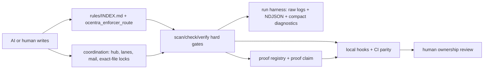
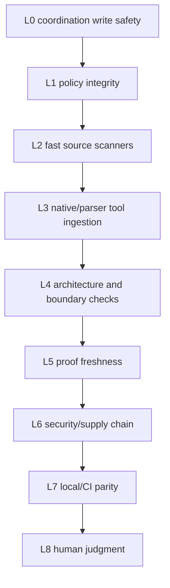

# Ocentra Enforcer

> **Do not rely on AI or human discipline. Make bad code mechanically impossible to land.**
>
> Human review should become ownership and judgment, not the first line of
> quality control. AI should be allowed to write, but the harness must act like
> a production compiler for architecture, code quality, type discipline,
> dependency policy, test integrity, proof freshness, and repository hygiene.

Standalone enforcement system for humans, CI, Codex skills, and MCP clients.
Rust, TypeScript/JavaScript, Python, common security/generated-artifact guards,
compact harness diagnostics, generic coordination, and architecture gates are
implemented as the first reusable platform slice.

Default consumption is package plus Codex plugin/MCP. Git submodules are allowed
only for projects that need source pinning; they are not the default install
model.

## System Map





## Main Systems

| System | What It Does | Main Entry Points | Details |
| --- | --- | --- | --- |
| Indexed rules | Routes agents to only the rule docs needed for touched files, scope, profile, or explicit rule ID. | `rules/INDEX.md`, `rules/rules.json`, `ocentra_enforcer_route` | [docs/RULE_ENFORCEMENT.md](docs/RULE_ENFORCEMENT.md) |
| Hard validators | Rejects source slop, architecture drift, policy bypasses, weak tests, dependency issues, generated artifacts, and secrets. | `ocentra-enforcer scan`, `ocentra-enforcer check`, `ocentra-enforcer verify` | [docs/ENFORCED_CHECKS.md](docs/ENFORCED_CHECKS.md) |
| Harness diagnostics | Runs native commands while preserving raw logs and returning compact structured diagnostics. | `ocentra-enforcer run`, `runs last-failure`, MCP diagnostics tools | [docs/HARNESS_DIAGNOSTICS.md](docs/HARNESS_DIAGNOSTICS.md) |
| Hub/lane coordination | Keeps Codex/human workers from racing on exact files and coordinates lanes, mail, claims, presence, sync, and repair. | `coordination claim/guard/release/health/presence/sync` | [docs/COORDINATION.md](docs/COORDINATION.md) |
| Skill and MCP system | Installs Codex skill/MCP wiring so any target repo can call the external pack without copying scripts. | `codex install`, `ocentra_enforcer_*` tools | [docs/SKILL_MCP_SYSTEM.md](docs/SKILL_MCP_SYSTEM.md) |
| Proof harness | Converts ad-hoc proof scripts into routed proof definitions, runs, artifacts, freshness checks, and PR-ready claims. | `proof route/run/import-legacy/parity/claim` | [docs/PROOF_SYSTEM_DESIGN.md](docs/PROOF_SYSTEM_DESIGN.md) |
| Governance | Protects the enforcer from being weakened by config, waivers, CI drift, unregistered rules, or repo ownership gaps. | `check policy-integrity`, `rule-coverage`, `mutation-risk`, `ci-integrity` | [rules/common/governance.md](rules/common/governance.md), [rules/common/registry.md](rules/common/registry.md), [rules/common/policy.md](rules/common/policy.md) |

## 1. Hard Gates Over Trust

Rules, AGENTS files, and skill docs are guidance, not enforcement. They help a
strong model choose the right path and they save tokens with indexed routing, but
models can miss rules when context is full, a smaller model is used, or the task
pressure is high. Humans can miss or bypass the same rules.

The harness is the reviewer of first resort. AI and humans may write code; the
harness decides whether the code is structurally acceptable. Human review begins
after mechanical policy, compiler/type/lint gates, architecture gates,
tests/proofs, dependency/security gates, and local/CI parity pass. Humans review
meaning, product judgment, intent, tradeoffs, and ownership; they should not be
the first line of defense for failures the harness can reject deterministically.

Ocentra Enforcer is built on zero trust for AI and humans. The point is not to
hope the writer remembers every rule; the harness, hooks, MCP tools, and CI gates
must reject bad code before it is accepted. A normal flow is:

1. Route to the smallest relevant rule docs.
2. Validate the exact file, crate, package, or repo scope.
3. Store compact structured diagnostics instead of forcing agents to read raw
   terminal walls.
4. Hard-fail violations in local runs, pre-commit, PR checks, and CI.

Policy therefore has two layers:

- Indexed rules explain what to do and keep agent context small.
- Validators and harness checks decide whether the work is accepted.

Every enforced rule must keep that dual shape. A `TS-*`, `PY-*`, `RR-*`, or
common `SEC-*`/`TEST-*`/`SRC-*` finding is not just a lint message: it must have
a `rules/rules.json` registry entry, a routed rule doc, a validator that emits
the same `ruleId`, and an `explain`/MCP path that tells Codex which rule to read
next. JSON and MCP reports include a `doc` anchor on findings for that reason.

If docs and validators disagree, the hard gate wins. Fix the code, fix the docs,
or strengthen the validator; do not add bypass comments or weaken checks to make
an agent pass.

## Enforced Checks Preview

The full catalog is [docs/ENFORCED_CHECKS.md](docs/ENFORCED_CHECKS.md). Current
hard gates include:

| Language / Area | Examples |
| --- | --- |
| Rust | No unsafe without policy, no `transmute` or `static mut`, no unchecked panics, no stringly errors, no swallowed results, no raw domain strings/primitives/generic string escape hatches, no boolean state clusters, no wildcard imports, no public re-exports, no unjustified clones/casts/indexing, async spawn/channel gates, serde DTO/domain gates, dependency/toolchain gates, and organized tests under `tests/`. |
| TypeScript/JavaScript | No barrel exports or re-exports, no Zod source when Effect Schema owns contracts, no `any`, no unsafe casts/non-null assertions, no default exports, no raw process/env or JSON parsing outside configured boundaries, no console debugging, no naked domain string aliases, no suppression comments, no weak/skipped/focused tests, source-shape limits, import-boundary checks, and no inline tests inside `src/`. |
| Python | No broad `noqa` or `type: ignore`, no `Any` or untyped defs, no mutable defaults, no broad/bare exceptions, no print debugging, no `subprocess shell=True`, no wildcard imports, no `requests` calls without timeout, no raw domain string aliases where schema brands are required, no skipped/focused tests, Ruff/Pyright/mypy/pytest ingestion, and no inline tests inside production source. |
| Common | Policy lockdown, waiver governance, rule-coverage enforcement, CI integrity, CODEOWNERS/repo governance, secret scanning, generated-artifact gates, test-double bans, required test scaffolds, organized test roots, single-source contract checks, portability checks, dependency/package determinism, SBOM, and agent-rule index hygiene. |

Documentation/comment checks are warnings by default. Projects can promote
those to hard failures through profile config, but the default hard-fail set is
focused on safety, architecture, test integrity, dependency/security, and
validation bypasses.

## 2. Indexed Decision Trees Save Context

Long plans, AGENTS files, workpacks, and rulebooks can consume the same context
the agent needs for the actual implementation. Ocentra Enforcer treats those
documents as routed knowledge, not default reading.

The intended pattern is:

1. Read a small index or decision matrix first.
2. Classify the task by language, files, scope, risk, and command.
3. Open only the rule docs and workpack sections that apply.
4. Fall back to broad reading only when the route is unknown or policy itself is
   being changed.

This gives large models less noise and gives small models a bounded path they can
follow. The route is also machine-readable, so Codex or another MCP client can
ask for the relevant rule IDs and docs before scanning or editing.

## 3. Structured Diagnostics Save Tokens

Raw command output is a poor agent interface. `cargo check`, test runners,
linters, and security tools often produce duplicate lines, progress noise, and
large terminal walls that burn context before the agent reaches the real failure.

Ocentra Enforcer runs commands through a harness that keeps the full raw
artifacts, then emits compact structured data:

- Raw stdout and stderr are preserved for audit and fallback.
- NDJSON events and diagnostics capture the useful facts.
- DuckDB-backed queries are the intended compact retrieval path when available.
- MCP tools expose last failure, diagnostics by run, file, rule, severity, crate,
  package, test, and artifact.

The agent should normally ask the harness for the last failure or scoped
diagnostics instead of reading the full terminal dump. Raw logs remain available
only when the compact result is not enough.

## 4. Coordination Belongs Outside Product Repos

Lane ownership, hub mail, exact-file claims, worker/task status, peer sync, and
Codex hook write-safety are harness concerns. They should not live inside a
product repo. Existing projects may have legacy local coordination or
architecture tools, but those are migration sources, not the target
architecture.

See [docs/COORDINATION.md](docs/COORDINATION.md) for the full hub/ledger/mail
model, storage layout, sync contract, safety decisions, and MCP/CLI workflow.

The generic direction for any target project is:

1. Enforcer owns coordination and architecture tooling.
2. A target repo only keeps configuration and thin command aliases.
3. Live coordination state stays under the Enforcer install ledger root,
   normally `<enforcer-install>/.ledger/<hub>`.
4. Each target project chooses its hub name, profile, adapters, and local
   wrappers without forking the Enforcer implementation.

Coordination MCP tools return compact machine-readable write-safety decisions:
`canInspect`, `canLockPaths`, `canWriteClaimedPaths`, `mustWait`, and
`mustRepairLedger`. Agents should use those instead of reading giant lane/worker
terminal dumps.

The lock model is deterministic:

- Same project, same worktree, same file is a hard `writeLock`.
- Different worktree, same branch, same file is a hard `branchWriteConflict`.
- Different branch, same file is a `mergeRisk` warning for edit and a blocker
  for `pr_ready` unless waived.
- Lockfiles, generated contracts/schema outputs, migrations, release files, and
  workflow config are `globalWriteLock` singleton paths by default.
- Blocked edit claims can use `onConflict=intent`; release sends mail to the
  next queued lane, which must re-read before editing.

Coordination also exposes a presence matrix. It answers which PC, project,
worktree, branch, Codex thread/session, lane, task, inbox, and exact-file claims
are active. Canonical truth is still append-only NDJSON streams under the
install ledger root. Generated JSON views and the optional SQLite read index are
disposable and can be rebuilt from streams after local writes, compaction, or
LAN/WAN peer sync.

LAN/WAN sync uses stream manifests plus suffix transfer. Peers compare event
counts and tail hashes, transfer only missing NDJSON lines, and write conflict
copies instead of overwriting divergent streams. The transport can be direct LAN
HTTP or a token-protected mesh/tunnel endpoint such as Tailscale, Cloudflare
Tunnel, WireGuard, or HTTPS.

During migration from legacy wrappers, coordination event hashes use the v1
ledger envelope so old readers and Enforcer agree. Enforcer still stores
extended `context` metadata for presence, but extension metadata is not part of
the v1 wire hash. If an early Enforcer build wrote context-hashed events into a
live legacy ledger, run `coordination repair legacy-hash` first as a dry-run,
then rerun with `--write` after reviewing the backup paths.

If doctor reports `sequence break` or `previous event pointer does not match
stream tip`, run `coordination repair sequence` as a dry-run, then rerun with
`--write` after reviewing changed streams and backup paths. If health still
reports stale ownership conflicts after stream repair, use
`coordination repair stale-claims --paths <exact-paths>` to inspect the matching
claims. Add `--owner <writer>` to preserve one active owner, or omit `--owner`
to clear all active claims for the exact paths. The write form appends a
`claim.resolve` event; it does not delete historical stream lines.

For subagents, prefer unique child lanes such as `codex-a-parser` or
`codex-a-ui` instead of multiple sessions trying to own the same `codex-a`
lease. The coordinator can keep the parent lane, while child lanes use exact
file claims and `coordination health/guard` for write safety. Same-lane work is
only safe when one process owns the lease or the environment has moved fully to
Enforcer claim checks without legacy wrapper lease enforcement.

## 5. Proof Claims Need Evidence, Not Hope

Product proof scripts are another zero-trust surface. A PR-ready or workpack
claim is not accepted because an agent says it ran something; it must point to a
fresh proof run with structured output, present artifacts, current commit/scope,
and explicit platform capability state.

Enforcer now owns the generic proof harness:

- `proof/INDEX.md` routes by files, plan, capability, or proof id.
- `proof/proofs.json` is the machine-readable proof registry.
- Proof runs are stored locally under the target repo at `.enforce/proofs`.
- Raw logs and screenshots stay local or CI-artifact-only by default.
- `proof claim --pr-ready` rejects missing, stale, manual-required, failed, or
  artifact-broken claims.

This is the migration path for any repo that accumulated many bespoke proof
scripts. Product repos should expose source, generated artifacts, config, and
domain expectations. Enforcer should own the runner, proof inventory, compact
diagnostics, retention, and MCP query surface.

## Commands

```bash
npm test
npm run test:rules
npm run test:mcp
npm run enforcer:init:dry-run
npm run codex:install:dry-run
npm run codex:doctor
npm run enforcer:rules:scan
npm run enforcer:rules
npm run proof:smoke
npm run proof:run:smoke
```

Direct CLI forms:

```bash
node scripts/rust-rules.mjs init --root C:/path/to/repo --profile strict --adapters codex,mcp,precommit,github-actions --dry-run
node scripts/rust-rules.mjs codex install --dry-run
node scripts/rust-rules.mjs codex install
node scripts/rust-rules.mjs codex doctor
node scripts/rust-rules.mjs codex install --root C:/path/to/repo --profile strict --dry-run
node scripts/rust-rules.mjs scan --root C:/path/to/repo --files src/lib.rs
node scripts/rust-rules.mjs scan --root C:/path/to/repo --crate my-crate
node scripts/rust-rules.mjs scan --root C:/path/to/repo --workspace
node scripts/rust-rules.mjs scan --root C:/path/to/repo --base origin/main --head HEAD
node scripts/rust-rules.mjs scan --root C:/path/to/repo --languages typescript,python,common --files src tests
node scripts/rust-rules.mjs check no-zod-source --root C:/path/to/repo --files src/index.ts
node scripts/rust-rules.mjs check validation-bypass --root C:/path/to/repo --files src/index.ts
node scripts/rust-rules.mjs check weak-assertions --root C:/path/to/repo --files tests/example.test.ts
node scripts/rust-rules.mjs check placeholder-implementation --root C:/path/to/repo --files src/index.ts
node scripts/rust-rules.mjs check rule-coverage --root C:/path/to/repo
node scripts/rust-rules.mjs check policy-integrity --root C:/path/to/repo
node scripts/rust-rules.mjs check mutation-risk --root C:/path/to/repo
node scripts/rust-rules.mjs check config-lockdown --root C:/path/to/repo
node scripts/rust-rules.mjs check waiver-policy --root C:/path/to/repo
node scripts/rust-rules.mjs verify --root C:/path/to/repo
node scripts/rust-rules.mjs check source-shape --root C:/path/to/repo --workspace
node scripts/rust-rules.mjs check single-source-contracts --root C:/path/to/repo --check-config scripts/check-single-source-contracts.json
node scripts/rust-rules.mjs check sbom --root C:/path/to/repo --output target/security --dry-run
node scripts/rust-rules.mjs cargo --root C:/path/to/repo --crate my-crate
node scripts/rust-rules.mjs doctor --root C:/path/to/repo --workspace
node scripts/rust-rules.mjs explain RR-7.3
node scripts/rust-rules.mjs run --root C:/path/to/repo --tool tsc -- npx tsc --noEmit --pretty false
node scripts/rust-rules.mjs runs last-failure --root C:/path/to/repo --json
node scripts/rust-rules.mjs proof route --root C:/path/to/repo --files scripts/test/example-proof.mjs --json
node scripts/rust-rules.mjs proof inventory --root C:/path/to/repo --json
node scripts/rust-rules.mjs proof inventory --root C:/path/to/repo --include-scripts --limit 20 --json
node scripts/rust-rules.mjs proof import-legacy --root C:/path/to/repo --proof PROOF-LEGACY-ARTIFACT-IMPORT --legacy-paths test-results/foo-proof,output/foo-proof --json
node scripts/rust-rules.mjs proof parity --root C:/path/to/repo --proof PROOF-LEGACY-ARTIFACT-IMPORT --legacy-paths test-results/foo-proof,output/foo-proof --run-id <import-run-id> --json
node scripts/rust-rules.mjs proof run --root C:/path/to/repo --proof PROOF-COMMAND-GENERIC --json -- node --version
node scripts/rust-rules.mjs proof claim --root C:/path/to/repo --proof PROOF-COMMAND-GENERIC --pr-ready --json
node scripts/rust-rules.mjs proof last-failure --root C:/path/to/repo --json
node scripts/rust-rules.mjs coordination init my-hub --lane codex-a --hub my-hub
node scripts/rust-rules.mjs coordination doctor --hub my-hub
node scripts/rust-rules.mjs coordination presence --hub my-hub
node scripts/rust-rules.mjs coordination index --hub my-hub
node scripts/rust-rules.mjs coordination manifest --hub my-hub
node scripts/rust-rules.mjs coordination peer add office http://office-pc:8787 --mode pull --hub my-hub
node scripts/rust-rules.mjs coordination sync --peer office --hub my-hub
node scripts/rust-rules.mjs coordination claim --hub my-hub --lane codex-a --paths src/lib.rs --operation edit --on-conflict intent --reason "exact file claim"
node scripts/rust-rules.mjs coordination guard --hub my-hub --lane codex-a --paths src/lib.rs --operation commit --json
node scripts/rust-rules.mjs coordination release --hub my-hub --lane codex-a --paths src/lib.rs --reason "exact file release"
node scripts/rust-rules.mjs coordination repair legacy-hash --hub my-hub
node scripts/rust-rules.mjs coordination repair legacy-hash --hub my-hub --write
node scripts/rust-rules.mjs coordination repair sequence --hub my-hub
node scripts/rust-rules.mjs coordination repair sequence --hub my-hub --write
node scripts/rust-rules.mjs coordination repair stale-claims --hub my-hub --paths src/lib.rs
node scripts/rust-rules.mjs coordination repair stale-claims --hub my-hub --paths src/lib.rs --owner node_abc.codex-a --write
node scripts/rust-rules.mjs architecture check --language rust --scope files --files src/lib.rs --root C:/path/to/repo
```

Use `--state-root <exact-hub-root>` only for legacy-root repair/import or other
emergency exact-root operations. Normal coordination uses `OCENTRA_LEDGER_HOME`
from Codex setup plus `--hub <hub>`.

Proof inventory is summary-only by default so agents do not load hundreds of
legacy proof scripts into context. Use `--include-scripts --limit <n>` only for
targeted migration batches.

After package install, the canonical entrypoints are:

```bash
ocentra-enforcer scan --root C:/path/to/project --files src/lib.rs
ocentra-enforcer-mcp
```

Compatibility aliases remain for one Rust-pack release:

```bash
rust-rules scan --root C:/path/to/project --files src/lib.rs
rust-rules-mcp
```

## Install / Init Model

Start with [INSTALL.md](INSTALL.md) for a fresh machine or fresh Codex setup.
Use [docs/CODEX_SETUP.md](docs/CODEX_SETUP.md) for MCP and skill wiring, and
[docs/TARGET_REPO_WIRING.md](docs/TARGET_REPO_WIRING.md) for target repo setup.
Project-specific parity notes should live in docs or config files for that
target project, not in the generic install path.

Run the Codex installer from the enforcer install path. By default it is a
global Codex setup: MCP config, user skill, and a managed global `AGENTS.md`
block. Pass `--root` only when you also want target repo wiring generated.

```bash
ocentra-enforcer codex install --dry-run
ocentra-enforcer codex install
ocentra-enforcer codex install --ledger-root E:/ocentra-enforcer/.ledger
ocentra-enforcer codex doctor
ocentra-enforcer codex install --root C:/path/to/repo --profile strict --dry-run
ocentra-enforcer codex doctor --root C:/path/to/repo
```

This updates Codex Desktop's global `config.toml` with an `ocentra-enforcer`
MCP server, installs the user skill, creates global agent instructions if
missing, and configures `OCENTRA_LEDGER_HOME`. By default the ledger root is
`<enforcer-install>/.ledger`, so hubs live under `.ledger/<hub>` and move with
the Enforcer install. Existing Codex config and global `AGENTS.md` are backed up
before they are changed. The installer writes TOML directly because
`codex mcp add` behavior can vary by app/CLI version and has been the most
common setup failure.

For hooks and CI adapters, run init separately:

```bash
ocentra-enforcer init --root C:/path/to/repo --profile strict --adapters codex,mcp,precommit,github-actions --dry-run
```

`--dry-run` prints the exact file plan without writing. The default hook adapter
is a plain Git hook for cross-platform use. Husky is generated only when
requested or when the target repo already uses Husky. Lefthook is opt-in.

MCP runs from the enforcer install path. Target projects always pass `root` plus
either `configPath` for project-specific policy or `profile` for a named pack
policy such as `strict`.

Example global MCP wiring:

```json
{
  "mcpServers": {
    "ocentra-enforcer": {
      "command": "node",
      "args": ["C:/path/to/ocentra-enforcer/mcp/rust-rules-mcp.mjs"]
    }
  }
}
```

Canonical MCP tools:

```text
ocentra_enforcer_route
ocentra_enforcer_scan
ocentra_enforcer_check
ocentra_enforcer_doctor
ocentra_enforcer_explain
ocentra_enforcer_mcp_status
ocentra_enforcer_run
ocentra_enforcer_run_status
ocentra_enforcer_diagnostics
ocentra_enforcer_last_failure
ocentra_enforcer_artifact
ocentra_enforcer_reset_runs
ocentra_enforcer_proof_route
ocentra_enforcer_proof_run
ocentra_enforcer_proof_status
ocentra_enforcer_proof_inventory
ocentra_enforcer_proof_claim
ocentra_enforcer_proof_last_failure
ocentra_enforcer_proof_diagnostics
ocentra_enforcer_proof_artifact
ocentra_enforcer_proof_reset
ocentra_enforcer_proof_prune
ocentra_enforcer_proof_export
ocentra_enforcer_coordination_init
ocentra_enforcer_coordination_health
ocentra_enforcer_coordination_presence
ocentra_enforcer_coordination_index
ocentra_enforcer_coordination_streams
ocentra_enforcer_coordination_sync
ocentra_enforcer_coordination_peer
ocentra_enforcer_coordination_ensure
ocentra_enforcer_coordination_compact
ocentra_enforcer_coordination_notify
ocentra_enforcer_coordination_mail
ocentra_enforcer_coordination_inbox
ocentra_enforcer_coordination_claim
ocentra_enforcer_coordination_release
ocentra_enforcer_coordination_guard
ocentra_enforcer_coordination_report
ocentra_enforcer_coordination_message
ocentra_enforcer_coordination_workers
ocentra_enforcer_coordination_tasks
```

For broad MCP `scan` and `check` calls, prefer compact output controls before
asking Codex to read a full report:

```json
{
  "diagnosticLimit": 20,
  "groupBy": "slice",
  "includeScope": false
}
```

`summaryOnly: true` returns counts, rule IDs, docs, and optional groups without
individual diagnostics. Direct MCP scan/check calls also update an in-process
validation summary, so `ocentra_enforcer_run_status` can return the latest
validation summary even when no harness command was run.

Legacy `rust_rules_*` MCP tool aliases remain for one Rust-pack compatibility
release.

Before direct MCP coordination writes, call `ocentra_enforcer_mcp_status`.
If it reports `stale: true`, restart Codex/MCP or call the updated CLI through
`ocentra_enforcer_run`. Stale MCP processes fail closed for coordination writes
because old code can corrupt live append-only ledger streams.
Require `directWritesAllowed: true` or `writeCompatible: true` before using
direct coordination write tools. `hashCompatible: true` is the deterministic
hash self-test; it does not override a stale MCP process. If direct writes are
refused, the stale response includes an `ocentra_enforcer_run` fallback command.

`ocentra_enforcer_coordination_guard` and CLI `coordination guard` are focused by
default when `paths` or `changedPaths` are provided. Findings contain blockers
for the requested changed paths; unrelated lane conflicts or old stream sequence
breaks are returned as bounded `globalWarnings` with counts. Use
`focused: false` or CLI `--all-conflicts` only for broad ledger triage.
Dedicated coordination write tools are not generic action dispatchers:
`ocentra_enforcer_coordination_claim` rejects `action: "release"`, and release
must use `ocentra_enforcer_coordination_release`.

MCP setup is intentionally documented in detail because path mistakes are the
most common failure. Run `npm run mcp:smoke`, `npm run mcp:smoke:ndjson`, and
`npm run codex:doctor` from this repo to separate MCP server protocol failures
from Codex app config failures before blaming the rules engine.

## Indexed Rules

Agents should read `rules/INDEX.md` first, call MCP `ocentra_enforcer_route`,
and then open only the returned docs. `docs/RustRules.md` remains the legacy
monolithic reference, not the default context load.

`rules/rules.json` is validated by Effect Schema at runtime and by tests.
JSON-schema-compatible artifacts live under `schemas/json/` for docs, MCP
clients, and non-Effect consumers.

## Profiles And Severity

Profiles decide what runs, what fails, and what is advisory. The default model
is strict about safety, architecture, bypasses, secrets, dependency policy, and
test integrity, while documentation/comment checks are warnings unless a project
opts into making them hard gates.

```json
{
  "profileName": "strict",
  "failOn": ["error"],
  "rules": {
    "DOC-1.1": { "enabled": true, "severity": "warning" },
    "TS-2.1": { "severity": "error" }
  },
  "tools": {
    "cargoDoc": { "enabled": false, "severity": "warning" },
    "cargoDeny": { "enabled": true, "severity": "error" }
  }
}
```

`violations` are findings whose severity is listed in `failOn`; they fail CLI,
MCP, hook, and CI gates. `warnings` are returned in reports but do not fail when
`failOn` is `["error"]`. A project can disable noisy advisory rules with
`"enabled": false`, or upgrade them with `"severity": "error"`.

## Harness Diagnostics

Use `ocentra-enforcer run` or MCP `ocentra_enforcer_run` for cargo, npm, tsc,
ESLint, Ruff, Pyright, mypy, pytest, and similar checks. The harness stores raw
stdout/stderr plus schema-shaped NDJSON under the target repo:

```text
.enforce/runs/<runId>/
.enforce/db/
```

Agents should query `runs last-failure` or `ocentra_enforcer_last_failure`
before opening raw artifacts.

## Main Files

- `scripts/rust-rules.mjs`: CLI compatibility entrypoint, Rust scanner, generic scanner integration, init, route, and harness command handling.
- `mcp/rust-rules-mcp.mjs`: MCP stdio server with canonical `ocentra_enforcer_*` tools and legacy `rust_rules_*` aliases.
- `server.json`: MCP server manifest for registries and future package/plugin consumers.
- `src/`: reusable routing, generic scanner, migrated check, path, and harness modules.
- `src/codex-install.mjs`: Codex Desktop MCP config installer with idempotent TOML upsert and backup-before-write.
- `schemas/effect/enforcer-schemas.mjs`: Effect Schema contract source for configs, profiles, registry, route requests, reports, violations, init, runs, diagnostics, and MCP payloads.
- `schemas/json/*.schema.json`: JSON-schema-compatible contract artifacts.
- `rules/INDEX.md`: agent-facing routing index.
- `rules/rules.json`: machine-readable rule registry.
- `rules/rust/*.md`, `rules/typescript/*.md`, `rules/python/*.md`, `rules/common/*.md`: small rule-family docs for selective loading.
- `adapters/`: templates for Codex/MCP wiring, plain Git hooks, Husky, Lefthook, GitHub Actions, CodeQL, dependency policy, secret scan, and SBOM.
- `INSTALL.md`: clone/install/validate flow for a fresh machine or fresh Codex.
- `docs/ENFORCED_CHECKS.md`: high-level catalog of Rust, TypeScript, Python, and common checks.
- `docs/CODEX_SETUP.md`: Codex MCP registration, manual config fallback, skill setup, and troubleshooting.
- `docs/COORDINATION.md`: generic hub/ledger/mail/worktree coordination model, storage, sync, presence, and safety gates.
- `docs/TARGET_REPO_WIRING.md`: how a target repo calls the external enforcer.
- `docs/BOOTSTRAP_PROMPT.md`: copy-paste prompt for a future Codex to install and wire the enforcer.
- `docs/INSTALL_REFERENCE_LESSONS.md`: install lessons adopted from the codebase-memory-mcp setup pattern and remaining public-packaging gaps.
- `profiles/*.json`: reusable named policy profiles for target projects.
- `rust-rules.config.json`: legacy strict default profile file, still supported.

## Migration Model

For any new or existing project, the target model is:

1. Install or clone Ocentra Enforcer once on the machine.
2. Run `ocentra-enforcer codex install` so Codex knows the MCP server, skill,
   and ledger root.
3. Run `ocentra-enforcer init --root <repo> --adapters ...` to generate target
   repo wrappers, hooks, CI, and config.
4. Keep product code in the product repo; keep reusable guards, coordination,
   proof collection, compact diagnostics, and architecture checks in Enforcer.
5. When migrating an existing project, keep local scripts as thin wrappers until
   Enforcer proves equivalent or stricter behavior for file, package/crate,
   diff, workspace, hook, and CI scopes.
6. Rewire wrappers to call `ocentra-enforcer scan`, `ocentra-enforcer check`,
   `ocentra-enforcer run`, or `ocentra-enforcer proof run`.
7. Delete duplicated repo-local guards only after machine-readable parity is
   proven and CI can run the Enforcer-backed replacement.
