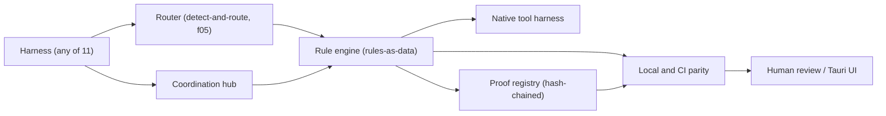
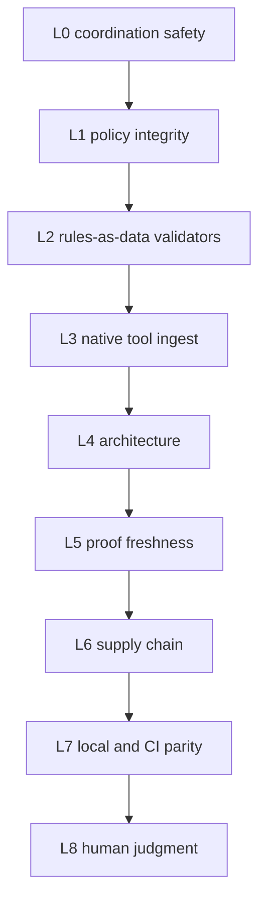

# Enforcer

<!-- ai-dense -->
```yaml
product: enforcer
form: single native Rust binary (Cargo workspace, ~29 crates); MCP stdio server AND CLI, same binary
distribution: cargo build --release per target -> GH Actions matrix (win/mac/linux + musl + apple-silicon) -> `enforcer install` downloads the binary, registers it as each harness's MCP server; zero runtime toolchain for consumers
rules: STRUCTURED DATA (typed records: ruleId <-> validator <-> fail/pass fixtures <-> doc-anchor <-> tier), not prose; .md is optional human-canonical reading only, browsed via the Tauri UI explorer (g08)
dogfood: native — enforcer's own Rust rules + `cargo clippy/fmt/deny/audit` validate its own crates (z01 terminal gate); NO TypeScript/Node detour
ts_scope: ONLY the Tauri UI frontend (types derived from enforcer-domain via ts_rs) and code the enforcer VALIDATES in a user's repo (TS/JS/Python/Dart/CFML via tree-sitter/swc/CFLint; Rust via syn) — never the enforcer's own implementation
capabilities:
  - router: detect-and-route (f05) — mechanically detects language/structure, dispatches validators + native tools
  - scan_modes: quick | full | scoped | diff | plan-scan (f01)
  - ui: Tauri desktop control-plane, optional (Track G) — config/customization (g05), rules-and-skills explorer (g08), live lane/hub panel (g06), scan report + actions (g02/g03), run-dispatch (g04)
  - install: multi-harness (11 adapters: claude, codex, gemini, antigravity, cursor, windsurf, zed, opencode, aider, kilocode, kiro), user/global scope by default (c-track)
  - onboarding: install -> inspect -> configure -> wire-CI -> verify, agent-first judgment loop + `.enforce/` autoindex scaffold (f02)
  - modes: silent (AgentInline) vs human (HumanReview) run context (f04)
  - languages_validated: rust (syn) | typescript/javascript (swc/tree-sitter) | python (tree-sitter) | dart (tree-sitter) | cfml (CFLint) | frontend/security/iac/k8s cross-cutting families
entrypoints: {cli: "enforcer scan|check|install|serve|plan|explain|...", mcp: "enforcer serve (stdio), tools mcp__enforcer__*"}
config: enforcer-config crate, 3-layer resolution (embedded global profile -> per-project enforcer-config.json override -> EffectiveConfig)
proof: enforcer-proof crate, hash-chained NDJSON journal, verify-on-open + on-replay
build_story: this repo is built BY a Fable-5-orchestrated cheap-model worker swarm dogfooding its own predecessor live — see "How This Was Built" below; every claim there resolves to refs/orchestration-lessons.md, memory/streams/*.ndjson, or a commit sha
```
<!-- /ai-dense -->

> **Do not rely on AI or human discipline. Make bad code mechanically impossible to land.**
>
> Human review should become ownership and judgment, not the first line of
> quality control. AI should be allowed to write, but the harness must act like
> a production compiler for architecture, code quality, type discipline,
> dependency policy, test integrity, proof freshness, and repository hygiene.

Enforcer is a standalone Rust enforcement engine for humans, CI, and any
MCP-speaking AI harness. It ships as **one native binary** — the same
executable is both the MCP stdio server and the CLI. It validates Rust,
TypeScript/JavaScript, Python, Dart, CFML, and common
security/generated-artifact/architecture concerns, and it runs its own rules
on its own source (native dogfood, no TypeScript/Node detour anywhere in the
engine).

The primary user of the enforcer is an AI agent talking to it over MCP. A
human can drive the identical behavior directly through the CLI — that is a
fully supported secondary path, not the design target. See
[RUST_ARCHITECTURE.md](docs/plans/enforcer-selfhost-plan/RUST_ARCHITECTURE.md)
for the full architecture doctrine this README summarizes.

Default consumption is **install once, use everywhere**: `enforcer install`
downloads the per-platform binary and registers it as your harness's MCP
server at user/global scope, so every repo you open already has it — no
per-repo copy, no per-repo toolchain.

## System Map


```mermaid
flowchart LR
  A["Harness (any of 11)"]
  B["Router (detect-and-route, f05)"]
  C["Rule engine (rules-as-data)"]
  D["Native tool harness"]
  E["Proof registry (hash-chained)"]
  F["Coordination hub"]
  G["Local and CI parity"]
  H["Human review / Tauri UI"]
  A --> B
  B --> C
  C --> D
  C --> E
  A --> F
  F --> C
  C --> G
  E --> G
  G --> H
```


```mermaid
flowchart TD
  L0["L0 coordination safety"]
  L1["L1 policy integrity"]
  L2["L2 rules-as-data validators"]
  L3["L3 native tool ingest"]
  L4["L4 architecture"]
  L5["L5 proof freshness"]
  L6["L6 supply chain"]
  L7["L7 local and CI parity"]
  L8["L8 human judgment"]
  L0 --> L1
  L1 --> L2
  L2 --> L3
  L3 --> L4
  L4 --> L5
  L5 --> L6
  L6 --> L7
  L7 --> L8
```

## Main Systems

| System | What It Does | Main Entry Points | Details |
| --- | --- | --- | --- |
| Rules-as-data engine | Typed rule records route agents to only what applies to touched files, scope, profile, or explicit rule ID — no prose loaded by default. | `enforcer explain <ruleId>`, `enforcer route`, `mcp__enforcer__route` | [docs/RULE_ENFORCEMENT.md](docs/RULE_ENFORCEMENT.md) |
| Hard validators | Rejects source slop, architecture drift, policy bypasses, weak tests, dependency issues, generated artifacts, and secrets — via native Rust `Validator` impls, not string scanning. | `enforcer scan`, `enforcer check`, `enforcer verify` | [docs/ENFORCED_CHECKS.md](docs/ENFORCED_CHECKS.md) |
| Detect-and-route router | Mechanically detects language/structure per file and dispatches to the right validator family and native tool. | `enforcer scan` (auto mode), `mcp__enforcer__scan` | [RUST_ARCHITECTURE.md](docs/plans/enforcer-selfhost-plan/RUST_ARCHITECTURE.md), [f05 workpack](docs/plans/enforcer-selfhost-plan/workpacks/f05-detect-and-route.md) |
| Scan modes | `quick` / `full` / `scoped` / `diff` / `plan-scan` typed scan modes for the right cost/coverage tradeoff. | `enforcer scan --mode <mode>` | [f01 workpack](docs/plans/enforcer-selfhost-plan/workpacks/f01-scan-modes-and-mcp.md) |
| Harness diagnostics | Runs native commands (cargo/tsc/ruff/dart/CFLint/...) while preserving raw logs and returning compact structured diagnostics. | `enforcer run`, `enforcer runs last-failure`, MCP diagnostics tools | [docs/HARNESS_DIAGNOSTICS.md](docs/HARNESS_DIAGNOSTICS.md) |
| Hub/lane coordination | Keeps parallel AI/human workers from racing on exact files; claims, guard, presence, mail, peer sync, and repair, implemented natively in Rust. | `enforcer coordination claim/guard/release/health/presence/sync` | [docs/COORDINATION.md](docs/COORDINATION.md) |
| Multi-harness install | Registers the single `enforcer` binary as the MCP server for any of 11 harnesses at user/global scope — Codex, Claude Code, Cursor, Windsurf, Gemini, Antigravity, OpenCode, Aider, KiloCode, Kiro, and any generic `.mcp.json` harness. | `enforcer install`, `enforcer doctor` | [docs/SKILL_MCP_SYSTEM.md](docs/SKILL_MCP_SYSTEM.md) |
| Onboarding + autoindex | One-time install -> inspect -> configure -> wire-CI -> verify judgment loop for a brand-new project, plus `.enforce/` scaffold. | `enforcer onboard`, [skills/enforcer-onboarding/SKILL.md](skills/enforcer-onboarding/SKILL.md) | [f02 workpack](docs/plans/enforcer-selfhost-plan/workpacks/f02-onboard-and-autoindex.md) |
| Silent vs human mode | `AgentInline` (silent, machine-consumed) vs `HumanReview` (verbose, human-consumed) run context selects report shape without changing what is enforced. | `enforcer scan --mode agent|human` | [f04 workpack](docs/plans/enforcer-selfhost-plan/workpacks/f04-silent-vs-human-mode.md) |
| UI control plane (optional) | Tauri desktop app (Rust backend, TS/web frontend) — config/customization, rules-and-skills explorer, live coordination panel, scan report + fix/ignore/waiver actions. Never required; the CLI/MCP works standalone. | `enforcer ui serve` | [RUST_ARCHITECTURE.md §UI](docs/plans/enforcer-selfhost-plan/RUST_ARCHITECTURE.md) |
| Proof harness | Converts ad-hoc proof scripts into routed proof definitions, runs, artifacts, freshness checks, and PR-ready claims, backed by a tamper-evident hash-chained journal. | `enforcer proof route/run/import-legacy/parity/claim` | [docs/PROOF_SYSTEM_DESIGN.md](docs/PROOF_SYSTEM_DESIGN.md) |
| Governance | Protects the enforcer from being weakened by config, waivers, CI drift, unregistered rules, or repo ownership gaps. | `enforcer check policy-integrity`, `rule-coverage`, `mutation-risk`, `ci-integrity` | [docs/RULE_ENFORCEMENT.md](docs/RULE_ENFORCEMENT.md) |

## 1. Hard Gates Over Trust

Rules, AGENTS files, and skill docs are guidance, not enforcement. They help a
strong model choose the right path and they save tokens with indexed routing,
but models can miss rules when context is full, a smaller model is used, or
task pressure is high. Humans can miss or bypass the same rules.

The harness is the reviewer of first resort. AI and humans may write code; the
harness decides whether the code is structurally acceptable. Human review
begins after mechanical policy, compiler/type/lint gates, architecture gates,
tests/proofs, dependency/security gates, and local/CI parity pass. Humans
review meaning, product judgment, intent, tradeoffs, and ownership; they
should not be the first line of defense for failures the harness can reject
deterministically.

The enforcer is built on zero trust for AI and humans. The point is not to
hope the writer remembers every rule; the harness, hooks, MCP tools, and CI
gates must reject bad code before it is accepted. A normal flow is:

1. Route to the smallest relevant rule set (typed records, not prose).
2. Validate the exact file, crate, package, or repo scope.
3. Store compact structured diagnostics instead of forcing agents to read raw
   terminal walls.
4. Hard-fail violations in local runs, pre-commit, PR checks, and CI.

Policy therefore has two layers:

- The rule registry explains what to do and keeps agent context small.
- Validators and harness checks decide whether the work is accepted.

Every enforced rule must keep that dual shape. A finding is not just a lint
message: it must have a registry entry (typed rule record), a `Validator`
implementation that emits the same `ruleId`, fail/pass fixtures, and an
`explain`/MCP path that tells the agent which rule fired and why. JSON and
MCP reports include a doc anchor on findings for that reason.

If docs and validators disagree, the hard gate wins. Fix the code, fix the
docs, or strengthen the validator; do not add bypass comments or weaken
checks to make an agent pass.

## Enforced Checks Preview

The full catalog is [docs/ENFORCED_CHECKS.md](docs/ENFORCED_CHECKS.md). Current
hard gates include:

| Language / Area | Examples |
| --- | --- |
| Rust | No unsafe without policy, no `transmute` or `static mut`, no unchecked panics, no stringly errors, no swallowed results, no raw domain strings/primitives/generic string escape hatches, no boolean state clusters, no wildcard imports, no public re-exports, no unjustified clones/casts/indexing, async spawn/channel gates, serde DTO/domain gates, dependency/toolchain gates, and organized tests under `tests/`. |
| TypeScript/JavaScript (validated, not our engine) | No barrel exports or re-exports, no unbranded/naked domain string aliases, no `any`, no unsafe casts/non-null assertions, no default exports, no raw process/env or JSON parsing outside configured boundaries, no console debugging, no suppression comments, no weak/skipped/focused tests, source-shape limits, import-boundary checks, and no inline tests inside `src/`. |
| Python (validated) | No broad `noqa` or `type: ignore`, no `Any` or untyped defs, no mutable defaults, no broad/bare exceptions, no print debugging, no `subprocess shell=True`, no wildcard imports, no `requests` calls without timeout, no raw domain string aliases where schema brands are required, no skipped/focused tests, Ruff/Pyright/mypy/pytest ingestion, and no inline tests inside production source. |
| Dart / CFML (validated) | tree-sitter-backed structural checks (Dart) and CFLint-backed checks (CFML), same fail/pass-fixture + `ruleId` discipline as every other language family. |
| Common | Policy lockdown, waiver governance, rule-coverage enforcement, CI integrity, CODEOWNERS/repo governance, secret scanning, generated-artifact gates, test-double bans, required test scaffolds, organized test roots, single-source contract checks, portability checks, dependency/package determinism, SBOM, and agent-rule index hygiene. |

Documentation/comment checks are warnings by default. Projects can promote
those to hard failures through profile config, but the default hard-fail set
is focused on safety, architecture, test integrity, dependency/security, and
validation bypasses.

"Validated" languages above are code the enforcer inspects in a *target*
repository — never the enforcer's own implementation language. The enforcer
itself is Rust end to end; the only TypeScript in this repository is the
optional Tauri UI frontend, whose types are derived from `enforcer-domain`
rather than hand-written.

## 2. Indexed Decision Trees Save Context

Long plans, AGENTS files, workpacks, and rule corpora can consume the same
context the agent needs for the actual implementation. The enforcer treats
those as routed knowledge, not default reading, and stores the canonical form
as typed data rather than prose.

The intended pattern is:

1. Call the router first (`enforcer route` / `mcp__enforcer__route`).
2. Classify the task by language, files, scope, risk, and command.
3. Open only the rule docs and workpack sections that apply — or, for an
   AI agent, consume the structured rule record directly and skip prose
   entirely.
4. Fall back to broad reading only when the route is unknown or policy itself
   is being changed.

This gives large models less noise and gives small models a bounded path they
can follow. The route is machine-readable, so any MCP client can ask for the
relevant rule IDs and docs before scanning or editing.

## 3. Structured Diagnostics Save Tokens

Raw command output is a poor agent interface. `cargo check`, test runners,
linters, and security tools often produce duplicate lines, progress noise, and
large terminal walls that burn context before the agent reaches the real
failure.

The enforcer runs commands through a harness that keeps the full raw
artifacts, then emits compact structured data:

- Raw stdout and stderr are preserved for audit and fallback.
- NDJSON events and diagnostics capture the useful facts.
- MCP tools expose last failure, diagnostics by run, file, rule, severity,
  crate, package, test, and artifact.

The agent should normally ask the harness for the last failure or scoped
diagnostics instead of reading the full terminal dump. Raw logs remain
available only when the compact result is not enough.

## 4. Coordination Belongs Outside Product Repos

Lane ownership, hub mail, exact-file claims, worker/task status, peer sync,
and harness hook write-safety are enforcer concerns, implemented natively in
Rust (`enforcer-coordination`). They should not live inside a product repo.

See [docs/COORDINATION.md](docs/COORDINATION.md) for the full hub/ledger/mail
model, storage layout, sync contract, safety decisions, and MCP/CLI workflow.

The generic direction for any target project is:

1. The enforcer owns coordination and architecture tooling.
2. A target repo only keeps configuration and thin command aliases.
3. Live coordination state stays under the enforcer's own ledger root, not the
   product repo.
4. Each target project chooses its hub name, profile, adapters, and local
   wrappers without forking the enforcer's implementation.

Coordination MCP tools return compact machine-readable write-safety decisions:
`canInspect`, `canLockPaths`, `canWriteClaimedPaths`, `mustWait`, and
`mustRepairLedger`. Agents should use those instead of reading giant lane/worker
terminal dumps.

The lock model is deterministic:

- Same project, same worktree, same file is a hard `writeLock`.
- Different worktree, same branch, same file is a hard `branchWriteConflict`.
- Different branch, same file is a `mergeRisk` warning for edit and a blocker
  for `pr_ready` unless waived.
- Lockfiles, generated contracts/schema outputs, migrations, release files, and
  workflow config are `globalWriteLock` singleton paths by default.
- Blocked edit claims can use `onConflict=intent`; release sends mail to the
  next queued lane, which must re-read before editing.

Coordination also exposes a presence matrix. It answers which machine,
project, worktree, branch, harness thread/session, lane, task, inbox, and
exact-file claims are active. Canonical truth is append-only NDJSON streams
under the ledger root; generated JSON/SQLite views are disposable and
rebuildable from streams.

LAN/WAN sync uses stream manifests plus suffix transfer. Peers compare event
counts and tail hashes, transfer only missing NDJSON lines, and write conflict
copies instead of overwriting divergent streams over LAN HTTP or a
token-protected mesh/tunnel transport.

## 5. Proof Claims Need Evidence, Not Hope

Proof scripts are another zero-trust surface. A PR-ready or workpack claim is
not accepted because an agent says it ran something; it must point to a fresh
proof run with structured output, present artifacts, current commit/scope, and
explicit platform capability state.

The enforcer owns the generic proof harness (`enforcer-proof`):

- Proof runs are stored locally under the target repo at `.enforce/proofs`.
- Raw logs and screenshots stay local or CI-artifact-only by default.
- `proof claim --pr-ready` rejects missing, stale, manual-required, failed, or
  artifact-broken claims.
- The journal is append-only and SHA-256 hash-chained, verified on open and on
  replay — a proof claim cannot be forged or silently rewritten.

## Research Grounding

The enforcer's design is built on cited research and validated practices, not
intuition or hope. Every architectural claim — context budgets [1],
AST-over-prose enforcement [2], ratchets [3], deferred-work gates [4], and
rules-as-structured-data [5] — is grounded in references and mechanically
enforced by validators.

See **[docs/research-grounding.md](docs/research-grounding.md)** for the full
citation list, how each principle is applied, and the specific crates and
validators that enforce them.

## Commands

Canonical CLI forms (the binary is `enforcer`, tri-modal scope
`<paths...> | --base <sha> --head <sha> | --all`, exit-code-driven):

```bash
enforcer init --root <repo> --profile strict --adapters claude,codex,precommit,github-actions --dry-run
enforcer scan --root <repo> --files src/lib.rs
enforcer scan --root <repo> --crate my-crate
enforcer scan --root <repo> --workspace
enforcer scan --root <repo> --base origin/main --head HEAD
enforcer scan --root <repo> --languages typescript,python,common --files src tests
enforcer check no-zod-source --root <repo> --files src/index.ts
enforcer check validation-bypass --root <repo> --files src/index.ts
enforcer check weak-assertions --root <repo> --files tests/example.test.ts
enforcer check placeholder-implementation --root <repo> --files src/index.ts
enforcer check rule-coverage --root <repo>
enforcer check policy-integrity --root <repo>
enforcer check mutation-risk --root <repo>
enforcer check config-lockdown --root <repo>
enforcer check waiver-policy --root <repo>
enforcer verify --root <repo>
enforcer check source-shape --root <repo> --workspace
enforcer check single-source-contracts --root <repo> --check-config scripts/check-single-source-contracts.json
enforcer check sbom --root <repo> --output target/security --dry-run
enforcer cargo --root <repo> --crate my-crate
enforcer doctor --root <repo> --workspace
enforcer explain RR-7.3
enforcer run --root <repo> --tool tsc -- npx tsc --noEmit --pretty false
enforcer runs last-failure --root <repo> --json
enforcer proof route --root <repo> --files scripts/test/example-proof.mjs --json
enforcer proof inventory --root <repo> --json
enforcer proof inventory --root <repo> --include-scripts --limit 20 --json
enforcer proof run --root <repo> --proof PROOF-COMMAND-GENERIC --json -- node --version
enforcer proof claim --root <repo> --proof PROOF-COMMAND-GENERIC --pr-ready --json
enforcer proof last-failure --root <repo> --json
enforcer coordination init my-hub --lane worker-a --hub my-hub
enforcer coordination doctor --hub my-hub
enforcer coordination presence --hub my-hub
enforcer coordination claim --hub my-hub --lane worker-a --paths src/lib.rs --operation edit --on-conflict intent --reason "exact file claim"
enforcer coordination guard --hub my-hub --lane worker-a --paths src/lib.rs --operation commit --json
enforcer coordination release --hub my-hub --lane worker-a --paths src/lib.rs --reason "exact file release"
enforcer coordination repair legacy-hash --hub my-hub
enforcer coordination repair sequence --hub my-hub
enforcer coordination repair stale-claims --hub my-hub --paths src/lib.rs
enforcer architecture check --language rust --scope files --files src/lib.rs --root <repo>
enforcer serve
```

Use `--state-root <exact-hub-root>` only for legacy-root repair/import or
other emergency exact-root operations. Normal coordination uses the
enforcer's own configured ledger home plus `--hub <hub>`.

Proof inventory is summary-only by default so agents do not load hundreds of
legacy proof scripts into context. Use `--include-scripts --limit <n>` only
for targeted migration batches.

Canonical MCP tools (all under one server name, `enforcer`):

```text
mcp__enforcer__route
mcp__enforcer__scan
mcp__enforcer__check
mcp__enforcer__doctor
mcp__enforcer__explain
mcp__enforcer__mcp_status
mcp__enforcer__run
mcp__enforcer__run_status
mcp__enforcer__diagnostics
mcp__enforcer__last_failure
mcp__enforcer__artifact
mcp__enforcer__reset_runs
mcp__enforcer__proof_route
mcp__enforcer__proof_run
mcp__enforcer__proof_status
mcp__enforcer__proof_inventory
mcp__enforcer__proof_claim
mcp__enforcer__proof_last_failure
mcp__enforcer__proof_diagnostics
mcp__enforcer__proof_artifact
mcp__enforcer__proof_reset
mcp__enforcer__proof_prune
mcp__enforcer__proof_export
mcp__enforcer__coordination_init
mcp__enforcer__coordination_health
mcp__enforcer__coordination_presence
mcp__enforcer__coordination_index
mcp__enforcer__coordination_streams
mcp__enforcer__coordination_sync
mcp__enforcer__coordination_peer
mcp__enforcer__coordination_ensure
mcp__enforcer__coordination_compact
mcp__enforcer__coordination_notify
mcp__enforcer__coordination_mail
mcp__enforcer__coordination_inbox
mcp__enforcer__coordination_claim
mcp__enforcer__coordination_release
mcp__enforcer__coordination_guard
mcp__enforcer__coordination_report
mcp__enforcer__coordination_message
mcp__enforcer__coordination_workers
mcp__enforcer__coordination_tasks
```

For broad MCP `scan` and `check` calls, prefer compact output controls before
asking the agent to read a full report:

```json
{
  "diagnosticLimit": 20,
  "groupBy": "slice",
  "includeScope": false
}
```

`summaryOnly: true` returns counts, rule IDs, docs, and optional groups
without individual diagnostics.

Before direct MCP coordination writes, call `mcp__enforcer__mcp_status`. If
it reports `stale: true`, update the enforcer binary; stale processes fail
closed for coordination writes because old code can corrupt live append-only
ledger streams. `mcp__enforcer__coordination_guard` and CLI
`coordination guard` are focused by default when `paths` or `changedPaths`
are provided.

## Install / Init Model

Start with [INSTALL.md](INSTALL.md) for a fresh machine. Use
[docs/CODEX_SETUP.md](docs/CODEX_SETUP.md) for per-harness MCP/skill wiring
details (Codex is one adapter of eleven, never the reference target), and
[docs/TARGET_REPO_WIRING.md](docs/TARGET_REPO_WIRING.md) for target repo
setup. Project-specific parity notes should live in docs or config files for
that target project, not in the generic install path.

`enforcer install` with no scope resolves to **user/global** — one install
per machine per harness registers the enforcer's MCP server, so every repo
you open already has it. `--scope project` is an explicit, non-default
opt-in, useful mainly for developing the enforcer itself.

```bash
enforcer install --dry-run
enforcer install
enforcer doctor
enforcer install --root <repo> --profile strict --dry-run
enforcer doctor --root <repo>
```

This registers the enforcer binary as the MCP server in every detected
harness's user-level config (mirroring how `codebase-memory-mcp` is
registered machine-wide — the top-level `mcpServers` map, never a per-repo
config file), installs the user skill, and creates global agent instructions
if missing. Existing harness config is backed up before it is changed.

For hooks and CI adapters, run init separately:

```bash
enforcer init --root <repo> --profile strict --adapters codex,mcp,precommit,github-actions --dry-run
```

`--dry-run` prints the exact file plan without writing. The default hook
adapter is a plain Git hook for cross-platform use. Husky is generated only
when requested or when the target repo already uses Husky.

### Updating

Once installed, staying current is a **binary swap**, not a repo pull:
`enforcer update` checks the release channel and, if a newer signed build
exists, removes the old binary and downloads the new one. Because the MCP
registration points at the binary path (not a repo/folder/branch), the
harness keeps firing the identical command; only the bytes behind it change.

## Rules-As-Data + Native Dogfood

Every rule is a typed record: `ruleId <-> Validator impl <-> {fail, pass}
fixtures <-> doc-anchor <-> tier`. The AI-facing surface is the structured
record and the `Validator`'s `Finding` output — never prose. `.md` rule docs
are kept only as an optional, human-canonical reading surface, browsed
through the Tauri UI rules-and-skills explorer (g08); the router never loads
them by default.

The enforcer runs itself: its own Rust rules and `cargo clippy` / `cargo
fmt --check` / `cargo deny` / `cargo audit` validate its own ~29 crates. This
is the terminal self-enforcement gate (`z01`, `xtask dogfood`) — the enforcer
proving, against itself, that everything it enforces holds.

## Profiles And Severity

Profiles decide what runs, what fails, and what is advisory. The default
model is strict about safety, architecture, bypasses, secrets, dependency
policy, and test integrity, while documentation/comment checks are warnings
unless a project opts into making them hard gates.

```json
{
  "profileName": "strict",
  "failOn": ["error"],
  "rules": {
    "DOC-1.1": { "enabled": true, "severity": "warning" },
    "TS-2.1": { "severity": "error" }
  },
  "tools": {
    "cargoDoc": { "enabled": false, "severity": "warning" },
    "cargoDeny": { "enabled": true, "severity": "error" }
  }
}
```

`violations` are findings whose severity is listed in `failOn`; they fail
CLI, MCP, hook, and CI gates. `warnings` are returned in reports but do not
fail when `failOn` is `["error"]`.

## Harness Diagnostics

Use `enforcer run` or MCP `mcp__enforcer__run` for cargo, npm, tsc, ESLint,
Ruff, Pyright, mypy, pytest, CFLint, and similar checks against a *target*
project. The harness stores raw stdout/stderr plus schema-shaped NDJSON under
the target repo:

```text
.enforce/runs/<runId>/
.enforce/db/
```

Agents should query `runs last-failure` or `mcp__enforcer__last_failure`
before opening raw artifacts.

## Main Crates

The enforcer is a Cargo workspace (`crates/`). Selected crates most relevant
to this README (full crate map in
[RUST_ARCHITECTURE.md](docs/plans/enforcer-selfhost-plan/RUST_ARCHITECTURE.md)):

- `enforcer-domain`: the single-source schema — branded newtypes + serde.
- `enforcer-rules` / `enforcer-validator`: the structured rule registry and
  the fixture/parity harness every validator proves itself against.
- `enforcer-lang-{rust,ts,py,common,security,iac,k8s}`: per-family validators.
- `enforcer-scan`: parallel scan engine, detect-and-route router, scan modes.
- `enforcer-coordination`: hub/lane/claim/guard/ledger/presence/sync.
- `enforcer-proof`: hash-chained proof journal, routed proofs, artifacts.
- `enforcer-mcp` / `enforcer-cli`: the stdio MCP server and clap CLI —
  compiled into the one `enforcer` binary.
- `enforcer-install`: the multi-harness installer + binary distribution.
- `enforcer-ui`: Tauri backend for the optional desktop control plane.
- `docs/ENFORCED_CHECKS.md`: high-level catalog of Rust, TypeScript, Python,
  Dart, CFML, and common checks.
- `docs/COORDINATION.md`: hub/ledger/mail/worktree coordination model.
- `docs/TARGET_REPO_WIRING.md`: how a target repo calls the installed
  enforcer.
- `INSTALL.md`: clone/build/validate flow for a fresh machine.

## Migration Model

For any new or existing project, the target model is:

1. Install the enforcer once per machine per harness (`enforcer install`).
2. Run `enforcer init --root <repo> --adapters ...` to generate target repo
   wrappers, hooks, CI, and config.
3. Keep product code in the product repo; keep reusable guards, coordination,
   proof collection, compact diagnostics, and architecture checks in the
   enforcer.
4. When migrating an existing project, keep local scripts as thin wrappers
   until the enforcer proves equivalent or stricter behavior for file,
   package/crate, diff, workspace, hook, and CI scopes.
5. Rewire wrappers to call `enforcer scan`, `enforcer check`, `enforcer run`,
   or `enforcer proof run`.
6. Delete duplicated repo-local guards only after machine-readable parity is
   proven and CI can run the enforcer-backed replacement.

## How This Was Built

<!-- ai-dense -->
```yaml
claim: this repo was built live, in Rust, by a Fable-5 orchestrator directing a cheap-model worker swarm (Sonnet on crate implementation, Haiku on docs/fixtures/mechanical packs, Opus on doctrine), coordinated through the enforcer's OWN coordination hub (claims/mail/presence) while dogfooding the PRIOR (.mjs) enforcer live on itself.
evidence_root: docs/plans/enforcer-selfhost-plan/refs/orchestration-lessons.md (append-only ledger, L1..L34+ as of this doc)
model_tiering_datapoint: "L8 — haiku d15 pack: 84k tok/37 calls, compliant but sloppy; sonnet a01 pack: 126k tok/109 calls, textbook incl. seeded-violation proof. Model tiering works under a strong capsule; capsule strength substitutes for model strength."
long_lived_worker_economics: "L11-FILL — measured: fresh a01=126k tok/109 calls; warm arc-01=181k/49 calls; warm arc-02=235k/32 calls. Tool-calls fall as bootstrap amortizes but tokens/pack climb ~45-55k per chained pack; by pack 3 cost is ~1.9x fresh. Doctrine derived: reuse a worker for at most 2 chained same-track packs, retire by pack 3 or ~200k cumulative tokens."
live_found_and_fixed_faults:
  - {id: L1, fault: "coordination_init threw raw EEXIST on re-init", fix: "init made idempotent", landed: "arc-16 api.rs + api.rs test init_is_idempotent_l1"}
  - {id: L2, fault: "hub context recorded server-resolved cwd instead of caller identity", fix: "caller identity required in claim/mail params, no server-cwd fallback", landed: "arc-16 api.rs CallerContext"}
  - {id: L13, fault: "coordination_claim rejected glob paths, capped 10 files/claim with no batching, narrow fetch refspec hid remote pushes", fix: "glob/dir claims + transparent batching + full fetch refspec in worker template", landed: "arc-16 api.rs normalize_owns_paths"}
  - {id: L17, fault: "committed LF content re-smudged to CRLF on fresh Windows checkout, breaking `cargo fmt --check` for every fresh clone even though the author's own long-lived worktree passed", fix: ".gitattributes pins checkout EOL per toolchain contract", landed: "commit 808a888"}
  - {id: L29, fault: "Windows UAC installer-detection heuristic fires on any exe named *install*, killing enforcer-install test binaries with os error 740", fix: "__COMPAT_LAYER=RunAsInvoker mitigation for test runs, durable asInvoker manifest routed to CI", landed: "gate now runs with the compat layer"}
learning_thesis_chain: "t0 (violation observed, L1/L2/L13 rows) -> t1 (Rust fix landed with tests, arc-16) -> t2 (recurrence-impossible confirmed by an INDEPENDENT api-inventory scout, not the same agent that made the fix) — see L1-FILL/L2-FILL/L13-FILL rows, each a completed proof-of-learning exhibit"
rules_as_data_benchmark: "L25 — the legacy .mjs enforcer hardcoded its language vocabulary (rust|typescript|python|common) and threw a hard schema error when a new IaC language was added; the Rust side absorbed 8 new IAC rule rows as pure data with zero sibling regression. This is the benchmark datapoint for the rewrite thesis: rules-as-data makes the engine open-world."
workspace_scale_measured: "full workspace `cargo test` 602+4 green at the x01 rename milestone (commit 56863ca and prior); ~29 crates per the crate map in RUST_ARCHITECTURE.md (25 arc-track + 3 Track-E language packs + enforcer-memory)"
verification_model: "worker (never self-declares pr_ready) -> orchestrator (integrates, declares pr_ready) -> gatekeeper (separate mind, verifies proofs vs plan, only green produces a PR) — L5"
checkpoint_discipline: "L19 — mid-pack checkpoint at proof-green milestones, not only at pack end, so a session-limit death loses at most the unpushed tail, never a whole pack"
falsifiability: "RUST_ARCHITECTURE.md 'the learning thesis' — a learning event is the triple (t0 observed, with provenance) -> (t1 artifact landed, fail-closed doctor) -> (t2+ recurrence query over the memory graph + the tamper-evident enforcer-proof journal) — 'the harness learned X' is a query with evidence, never a vibe"
```
<!-- /ai-dense -->

This repository was rebuilt, live, by the system it now ships. Concretely:

A **Fable-5 orchestrator** directed a swarm of cheap-model workers — Sonnet
doing crate implementation, Haiku doing docs/fixtures/mechanical packs, Opus
weighing in on doctrine — through **the enforcer's own coordination hub**
(the same claims/mail/presence primitives documented in
[docs/COORDINATION.md](docs/COORDINATION.md)), while the *prior*, legacy
`.mjs` enforcer ran live throughout the build, dogfooding itself on the very
code that was rewriting it. Every worker had to fetch, claim exact files,
guard before commit, and release — the coordination system was not a
demonstration; it was load-bearing plumbing for its own construction.

This is not a marketing narrative. Every claim below resolves to a specific
row in the append-only lessons ledger
([`refs/orchestration-lessons.md`](docs/plans/enforcer-selfhost-plan/refs/orchestration-lessons.md)),
a `memory/streams/*.ndjson` worker log, or a commit sha — check any of them
yourself.

**The economics were measured, not assumed.** A model-tiering experiment
(`L8`) found that a strong capsule (a tightly-scoped, doctrine-heavy prompt)
let a cheap model (Haiku) turn in compliant work on mechanical packs at 84k
tokens/37 calls, while a frontier model (Sonnet) spent 126k tokens/109 calls
on a judgment-heavy crate pack but delivered textbook output including a
seeded-violation proof. A follow-up measurement (`L11-FILL`) tracked a
long-lived worker across three chained packs in the same track: tool-calls
fell as bootstrap cost amortized, but tokens per pack climbed roughly
45-55k from carried context, so cost was already ~1.9x the fresh-spawn
baseline by the third pack — the resulting doctrine (retire a worker by pack
three, or ~200k cumulative tokens, whichever comes first) is a number, not a
guess.

**Real faults were found and fixed live**, each with an artifact you can
open right now: coordination `init` threw a raw filesystem error on
re-initialization instead of behaving idempotently (`L1`, fixed in
`crates/enforcer-coordination`'s `api.rs`, proven by
`init_is_idempotent_l1`); the hub trusted server-resolved working directory
instead of requiring the caller to assert its own identity, which silently
mis-attributed one worker's writes to another (`L2`, same file, `CallerContext`
now mandatory); claims rejected glob/directory ownership and silently capped
batches at ten files, forcing manual splitting (`L13`, fixed by
`normalize_owns_paths`); a formatter that pins Unix line endings met a
Windows checkout that re-smudged committed LF content back to CRLF, so a
*fresh* clone failed `cargo fmt --check` even though the original author's
long-lived worktree passed clean (`L17`, fixed by a checkout-level
`.gitattributes` contract, commit `808a888`); and a Windows UAC heuristic
that flags any executable whose filename contains "install" killed the
`enforcer-install` crate's own test binaries with error 740 (`L29`, worked
around with `__COMPAT_LAYER=RunAsInvoker`, durable fix routed to CI).

**Learning is provable, not just claimed.** The system's own doctrine defines
a learning event as a falsifiable triple: **t0** — a violation or incident is
observed and recorded with its provenance; **t1** — a landed artifact (a rule,
a fix, fixtures, a doctrine block) closes it; **t2** — an *independent* check
— not the same agent that made the fix — confirms recurrence is now
impossible by construction. Three of the faults above completed this whole
chain during the build itself: `L1-FILL`, `L2-FILL`, and `L13-FILL` record an
independent API-inventory scout cross-checking, after the fact, that each fix
actually landed in the compiled Rust code exactly as claimed — not merely that
someone said it did.

**The rewrite's own central thesis got a live benchmark.** The legacy `.mjs`
enforcer hardcoded its language vocabulary as an enum
(`rust|typescript|python|common`) and threw a hard schema error the moment a
new IaC rule family was introduced. The Rust rewrite absorbed eight new IaC
rule rows as pure data, with zero regression anywhere else in the system
(`L25`). That is the rules-as-data argument made concrete: extension is rows,
not patches.

**Scale, measured at a real milestone:** at the commit where the product
rename to `enforcer` landed (`56863ca` and its immediate predecessors), the
full workspace `cargo test` run was **602+4 tests green**, `clippy -D
warnings` and `cargo fmt --check` clean, across roughly 29 crates (25 from
the primary architecture track, 3 language packs, plus the harness-memory
crate) — a number pulled directly from that milestone's proof row in
[`TEST_PROOF_EXPECTATIONS.md`](docs/plans/enforcer-selfhost-plan/TEST_PROOF_EXPECTATIONS.md),
not an estimate.

**Verification stayed three-role even under swarm pressure**: a worker never
declares its own work `pr_ready`; the orchestrator integrates and declares
`pr_ready`; a separate gatekeeper mind verifies proofs against the plan, and
only a green gatekeeper produces a PR (`L5`). Combined with mid-pack
checkpointing at proof-green milestones rather than only at pack end (`L19`),
a session-limit death — which did happen mid-swarm — lost at most an
unpushed tail, never a whole pack's work.

None of this is aspirational framing bolted on afterward. It is why the
lessons ledger exists in the first place: every entry names where the lesson
*landed* — a file, a test, a commit — because, per the ledger's own rule, "a
lesson without a landed artifact is not captured, it is a TODO wearing a
hat." Read the ledger, open the cited files, run the cited tests. The receipts
are the point.
