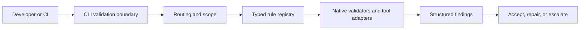

# Ocentra Enforcer

<!-- ai-dense -->
```yaml
product: native Rust repository-enforcement engine
entrypoints: "enforcer CLI | enforcer serve (MCP stdio) | optional Tauri UI"
core_model: "typed rules + deterministic validators -> structured findings"
scopes: "check/scan/verify: paths | git diff (--base/--head) | --all; verify also selects a named mode"
workflow: "choose the smallest check/scan/verify scope -> repair findings -> widen validation"
implementation: "Rust workspace; TypeScript is presentation-only in the optional UI"
```
<!-- /ai-dense -->

Ocentra Enforcer is a native Rust enforcement engine for local development
and CI, with an MCP control boundary for coding assistants. It makes
repository policy executable:
the same rule system can scan a scope and return structured findings through
the native CLI. Additional proof, diagnostics, and coordination engines exist
in the workspace, but not every engine is wired to every public boundary yet.

The goal is straightforward: code should be accepted because deterministic
checks support it, not because a person or agent remembered every convention.

## What it provides

- A Rust CLI and MCP stdio server from one codebase.
- Typed rule records with documented IDs, validators, fixtures, and findings.
- File, directory, workspace, and diff-oriented validation scopes.
- Native Rust validation plus structural validation for TypeScript/JavaScript,
  Python, Dart, CFML, configuration, CI, dependencies, and generated files.
- Library support for durable run diagnostics, proof artifacts, and
  coordination, with public-boundary availability documented below.
- An optional Tauri control plane; the CLI remains standalone.

## Architecture


```mermaid
flowchart LR
  A["Developer or CI"] --> B["CLI validation boundary"]
  B --> C["Routing and scope"]
  C --> D["Typed rule registry"]
  D --> E["Native validators and tool adapters"]
  E --> F["Structured findings"]
  F --> G["Accept, repair, or escalate"]
```

The Rust workspace separates the concerns deliberately:

| Area | Responsibility |
| --- | --- |
| `enforcer-cli` | Command-line contract and human-readable output. |
| `enforcer-mcp` | Stdio MCP boundary and structured tool responses. |
| `enforcer-rules` / `enforcer-validator` | Rule registry, policy evaluation, and validation. |
| Language crates | Syntax-aware Rust, TypeScript/JavaScript, Python, Dart, CFML, infrastructure, and security analysis. |
| `enforcer-proof` / `enforcer-harness` | Durable run records, artifacts, and tool-result ingestion. |
| `enforcer-coordination` | Optional claims, guard decisions, mail, and ledger state. |
| `enforcer-ui` | Optional desktop control plane. |

See [the architecture guide](docs/ARCHITECTURE.md) for boundaries and runtime
flow.

## Build from source

Requirements:

- Rust stable with Cargo
- Node.js only when building or working on the optional Tauri frontend

```powershell
cargo check --workspace
cargo test --workspace
cargo build --release -p enforcer-cli
```

During development, invoke the CLI through Cargo:

```powershell
cargo run -p enforcer-cli -- --help
cargo run -p enforcer-cli -- check --help
cargo run -p enforcer-cli -- serve --help
```

The current CLI surface is `check`, `scan`, `serve`, `ui`, `install`, `plan`,
`proof`, `coordination` (alias `ledger`), `memory`, `verify`, `advise`,
`architecture`, `onboard`, and `hook`. `check`, `scan`, and `verify` accept one
explicit scope: paths, a `--base`/`--head` diff pair, or `--all`; `verify`
also selects a named verification mode. Use `--help` as the source of truth
for the build you are running.

`install` is currently a no-argument, user-level operation that registers the
native binary with all supported harness adapters and runs its internal health
check. The visible `plan`, `proof`, and `coordination` command groups are
reserved boundaries; this build does not yet expose subcommands for them.

`memory cli` forwards a requested codebase-memory operation to the native
memory transport. `hook pretooluse` evaluates a Claude Code edit/write payload
from standard input before the write is accepted.

The Rust MCP server currently executes four tool families: server status,
coordination status, exact-path coordination claim, and UI launch/status.
Other tools may appear in MCP discovery as registered contracts, but they
currently return a structured not-wired error and must not be used as product
capabilities.

## Typical workflow

1. Choose an explicit CLI scope with `check`, `scan`, or `verify`.
2. Run the smallest meaningful validation scope.
3. Read compact diagnostics and repair the reported condition.
4. Retain the command output or report required by the repository's current
   evidence process; the native proof command is not wired yet.
5. Run the wider local or CI gate before accepting the change.

For repositories wired to the frozen Node compatibility service, its route
tool may still be used according to that service's own documentation. The
current Rust CLI and MCP server do not expose a working route operation.

## Documentation

- [Architecture](docs/ARCHITECTURE.md)
- [Enforced checks](docs/ENFORCED_CHECKS.md)
- [Target repository wiring](docs/TARGET_REPO_WIRING.md)
- [MCP and harness setup](docs/CODEX_SETUP.md)
- [Coordination model](docs/COORDINATION.md)
- [Release policy](docs/RELEASE_POLICY.md)

Internal planning material is intentionally kept under `docs/plans/`; it is
not the product contract. The current CLI, tests, and validators define the
supported runtime behavior.

## Contribution and verification

Use the smallest scoped Enforcer check while editing, then run the appropriate
workspace gate before declaring work complete. Do not weaken a policy, suppress
a test, or add a broad waiver simply to produce a green result.

```powershell
cargo fmt --check
cargo clippy --workspace -- -D warnings
cargo test --workspace
```

See [CONTRIBUTING.md](CONTRIBUTING.md) and [SECURITY.md](SECURITY.md) for
contribution and security-reporting expectations.
