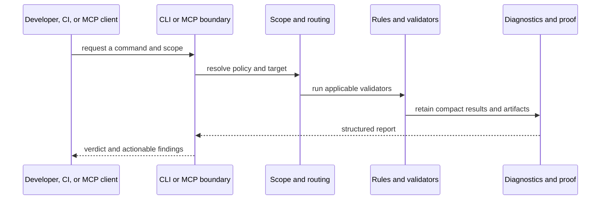

# Architecture

<!-- ai-dense -->
```yaml
engine: native Rust workspace
public_boundaries: "CLI | MCP stdio | optional desktop UI"
decision_owner: "typed rules and validators return structured findings"
target_languages: "Rust, TypeScript/JavaScript, Python, Dart, CFML, infrastructure, security"
ui_boundary: "Tauri presentation invokes Rust-owned state and actions; it does not make policy decisions"
runtime_truth: "enforcer --help and command-specific help for the binary under test"
```
<!-- /ai-dense -->

Ocentra Enforcer is a Rust workspace that exposes one enforcement model through
the CLI, MCP, automation, and an optional desktop UI. The product boundary is
the typed rule and finding model: callers request work, validators evaluate a
defined scope, and the result is returned as structured findings with stable
rule identifiers.

## Runtime flow



## Core boundaries

| Boundary | Purpose |
| --- | --- |
| CLI | Stable commands, output modes, and exit codes for people and CI. |
| MCP | Stdio tools that return compact structured results for assistants. |
| Configuration | Resolves embedded defaults and repository-level policy into an effective configuration. |
| Rules and validators | Own rule metadata, applicability, findings, fixtures, and deterministic decisions. |
| Language analysis | Keeps language-specific parsing and validation behind explicit crates. |
| Harness and proof | Retains command diagnostics and reproducible evidence without making raw terminal output the primary interface. |
| Coordination | Provides optional, external-to-product-repos state for claims and handoffs. |
| UI | Presents the same Rust-owned state and actions; presentation code does not own enforcement logic. |

## Enforcement model

Enforcer treats documentation as an explanation layer, not a bypass path. A
rule that blocks work should have a stable identifier, a validator, fixtures,
and a route for finding the relevant guidance. A policy change must be proven
by the corresponding test and validation surface.

The supported implementation languages are deliberately separated from target
languages. Enforcer itself is Rust. The optional desktop frontend is a thin
Tauri presentation layer; language analyzers inspect source in the target
repository rather than moving engine decisions into frontend code.

## Operational modes

- **CLI:** local and CI use through commands such as `check`, `scan`, and
  `verify`.
- **MCP:** structured routing, checks, diagnostics, proof, and coordination
  operations over stdio.
- **UI:** optional human control plane for inspecting state and invoking
  Rust-owned actions.

## Capability map

The command boundary supports focused repository checks and scans, named
verification modes, a stdio MCP server, onboarding, architecture checks, and
an optional desktop surface. Routing is deliberately separate from validation:
the route identifies applicable policy and a smallest useful scope; validators
then return findings for that scope.

The workspace also separates human and unattended use. MCP and CI consumers
receive compact structured results suitable for automation, while the CLI and
desktop surface provide a human-readable control plane over the same Rust-owned
contracts. Coordination, when enabled, is installation-level state for claims
and handoffs rather than application state stored in a target repository.

Consult `enforcer --help` and the command-specific help for the exact command
contract available in the current build.
