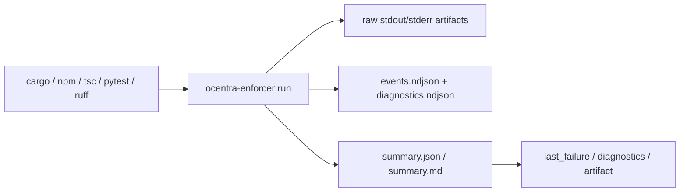

# Harness Diagnostics

The harness exists because raw terminal output is a poor AI interface. Native
tools still run, but Codex should query compact diagnostics before reading raw
logs.

## Flow



## Storage

Target repos store runtime harness state under:

```text
.enforce/runs/<runId>/
.enforce/db/
```

Raw logs are preserved for audit. Compact diagnostics are the default AI-facing
surface. Retention and prune commands keep old run data bounded.

## Query Pattern

```bash
ocentra-enforcer run --root <repo> --tool cargo -- cargo check --workspace
ocentra-enforcer runs last-failure --root <repo> --json
ocentra-enforcer runs diagnostics --root <repo> --run-id <runId> --json
ocentra-enforcer runs artifact --root <repo> --run-id <runId> --artifact stdout --limit-bytes 8000
```

MCP equivalents are `ocentra_enforcer_run`,
`ocentra_enforcer_last_failure`, `ocentra_enforcer_diagnostics`, and
`ocentra_enforcer_artifact`.
