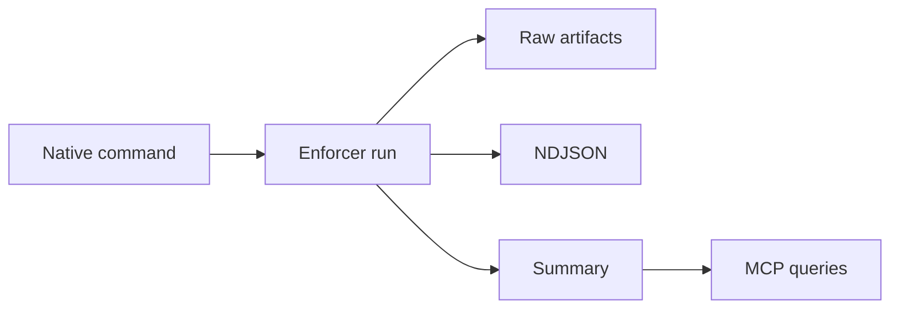

# Harness Diagnostics

<!-- ai-dense -->
```yaml
purpose: compact structured diagnostics over raw terminal output for native tool runs (cargo/tsc/ruff/dart/CFLint/...)
storage: ".enforce/runs/<runId>/ + .enforce/db/ under the TARGET repo"
query_first: "mcp__enforcer__last_failure / enforcer runs last-failure before reading raw stdout/stderr artifacts"
```
<!-- /ai-dense -->

The harness exists because raw terminal output is a poor AI interface.
Native tools still run, but any AI harness should query compact diagnostics
before reading raw logs.

## Flow


```mermaid
flowchart LR
  A["Native command"]
  B["Enforcer run"]
  C["Raw artifacts"]
  D["NDJSON"]
  E["Summary"]
  F["MCP queries"]
  A --> B
  B --> C
  B --> D
  B --> E
  E --> F
```

## Storage

Target repos store runtime harness state under:

```text
.enforce/runs/<runId>/
.enforce/db/
```

Raw logs are preserved for audit. Compact diagnostics are the default AI-facing
surface. Retention and prune commands keep old run data bounded.

## Query Pattern

```bash
enforcer run --root <repo> --tool cargo -- cargo check --workspace
enforcer runs last-failure --root <repo> --json
enforcer runs diagnostics --root <repo> --run-id <runId> --json
enforcer runs artifact --root <repo> --run-id <runId> --artifact stdout --limit-bytes 8000
```

MCP equivalents are `mcp__enforcer__run`,
`mcp__enforcer__last_failure`, `mcp__enforcer__diagnostics`, and
`mcp__enforcer__artifact`.
