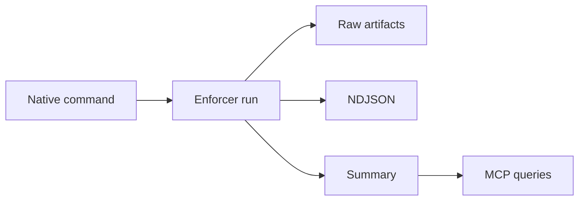

# Harness Diagnostics

<!-- ai-dense -->
```yaml
purpose: compact structured diagnostics over raw terminal output for native tool runs (cargo/tsc/ruff/dart/CFLint/...)
storage: ".enforce/runs/<runId>/ + .enforce/db/ under the TARGET repo"
public_status: "library and desktop read-only surfaces exist; native CLI and Rust MCP diagnostics commands are not wired"
```
<!-- /ai-dense -->

The harness exists because raw terminal output is a poor AI interface.
The workspace contains typed run storage and compact diagnostic models. The
current native CLI does not expose `run` or `runs`, and the Rust MCP diagnostic
tools are registered but not wired to their engine delegates.

## Flow


```mermaid
flowchart LR
  A["Native command"]
  B["Enforcer run"]
  C["Raw artifacts"]
  D["NDJSON"]
  E["Summary"]
  F["MCP queries"]
  A --> B
  B --> C
  B --> D
  B --> E
  E --> F
```

## Storage

Target repos store runtime harness state under:

```text
.enforce/runs/<runId>/
.enforce/db/
```

The storage model is an engine contract, not a promise that the current public
binary can create or prune these records. The desktop Runs workspace can
inspect existing records but is read-only.

## Current Access

Use the desktop Runs workspace to inspect records that already exist. For a
fresh validation, invoke the real tool directly or use `enforcer check`,
`scan`, or `verify`, and retain its report according to the target repository's
evidence process. Do not document `enforcer run`, `enforcer runs`, or MCP
diagnostic tools as executable until those public boundaries are wired.
