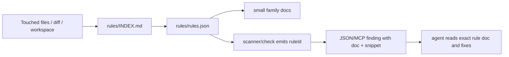

# Rule Enforcement System

Ocentra Enforcer does not treat rules as prose. Every enforced rule must be
routable, registered, validator-backed, and explainable through CLI/MCP output.

## Flow

## Contracts

| Contract | Enforcement |
| --- | --- |
| Rule ID exists once | `check rule-coverage` rejects duplicates and missing registry entries. |
| Registry doc exists | `check rule-coverage` verifies doc paths and anchors. |
| Scanner IDs are registered | `check rule-coverage` scans validator/check source for emitted IDs. |
| Immutable rules stay hard | `check policy-integrity` rejects disable/downgrade attempts. |
| Waivers are governed | `check waiver-policy` rejects broad, expired, ownerless, or AI-owned waivers. |
| Policy-critical edits get stronger proof | `check mutation-risk` reports the required proof set for changed enforcer files. |

## Rule Families

| Prefix | Area |
| --- | --- |
| `RR-*` | Rust source, domain, async/runtime, imports, Cargo, dependencies, tests. |
| `TS-*` | TypeScript/JavaScript source, exports, suppressions, tests, toolchain. |
| `PY-*` | Python source, suppressions, typing, exceptions, tests, toolchain. |
| `SEC-*`, `DEP-*`, `SBOM-*` | Security and supply-chain checks. |
| `TEST-*` | Weak tests, skipped/focused tests, test-double policy, organized tests. |
| `SRC-*`, `CONTRACT-*`, `GEN-*` | Source shape, single-source contracts, generated artifacts. |
| `ENF-*`, `CFG-*`, `WAIVER-*`, `CI-*`, `REPO-*` | Enforcer self-protection and governance. |

## Done Criteria

A rule is not done until it has a registry row, doc anchor, validator emission,
test evidence, and a CLI/MCP path that returns the same `ruleId`.
