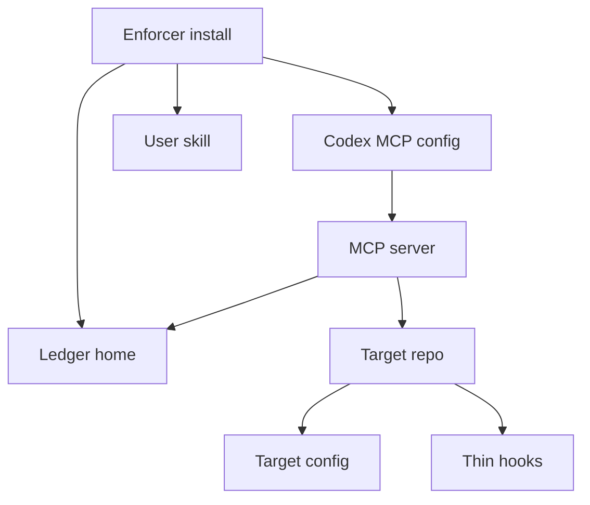

# Skill And MCP System

The install model is package plus Codex skill/MCP. A target repo should not copy
the enforcer implementation. It should call the external pack.

## Install Shape



## Commands

```bash
ocentra-enforcer codex install --dry-run
ocentra-enforcer codex install
ocentra-enforcer codex doctor
ocentra-enforcer init --root <repo> --profile strict --adapters codex,mcp,precommit,github-actions --dry-run
```

## MCP Safety

Direct coordination write tools fail closed when the MCP server is stale. The
stale response includes an `ocentra_enforcer_run` fallback command so agents can
use the updated CLI without corrupting append-only coordination streams.

Agents should call `ocentra_enforcer_mcp_status` before direct coordination
writes and require `directWritesAllowed: true`.

## Skill Workflow

1. Read `rules/INDEX.md`.
2. Call `ocentra_enforcer_route`.
3. Open only routed rule docs.
4. Use `scan`, `check`, `verify`, `run`, and `proof` tools by smallest scope.
5. Treat `violations` as hard failures.
