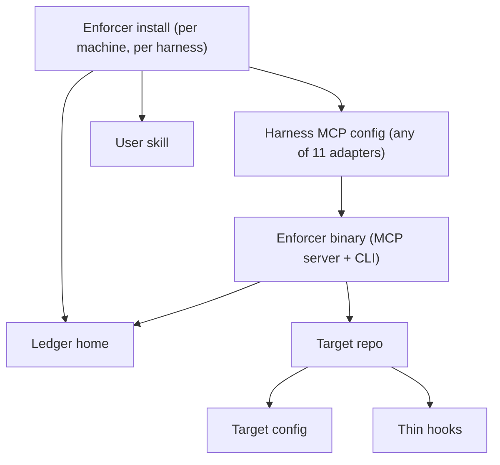

# Skill And MCP System

<!-- ai-dense -->
```yaml
install_model: single native `enforcer` binary registers as MCP server (user/global scope, any of 11 harnesses) + installs a skill; target repos never copy the implementation
commands: "enforcer install [--dry-run]; enforcer doctor; enforcer init --root <repo> --profile strict --adapters <harness>,mcp,precommit,github-actions --dry-run"
mcp_safety: "direct coordination writes fail closed when mcp__enforcer__mcp_status reports stale; fallback = the updated CLI via mcp__enforcer__run"
skill_workflow: "route -> open only routed rule records -> scan/check/verify/run/proof by smallest scope -> violations are hard failures"
```
<!-- /ai-dense -->

The install model is: one native binary plus a per-harness skill/MCP
registration. A target repo should not copy the enforcer implementation. It
should call the installed binary.

## Install Shape


```mermaid
flowchart TD
  A["Enforcer install (per machine, per harness)"]
  B["Harness MCP config (any of 11 adapters)"]
  C["User skill"]
  D["Ledger home"]
  E["Target repo"]
  F["Target config"]
  G["Thin hooks"]
  H["Enforcer binary (MCP server + CLI)"]
  A --> B
  A --> C
  A --> D
  E --> F
  E --> G
  B --> H
  H --> E
  H --> D
```

## Commands

```bash
enforcer install --dry-run
enforcer install
enforcer doctor
enforcer init --root <repo> --profile strict --adapters codex,mcp,precommit,github-actions --dry-run
```

## MCP Safety

Direct coordination write tools fail closed when the MCP server is stale. The
stale response includes an `mcp__enforcer__run` fallback command so agents
can use the updated CLI without corrupting append-only coordination streams.

Agents should call `mcp__enforcer__mcp_status` before direct coordination
writes and require `directWritesAllowed: true`.

## Skill Workflow

1. Call `mcp__enforcer__route` / `enforcer route`.
2. Open only the routed rule records — never the full rule corpus by
   default.
3. Use `scan`, `check`, `verify`, `run`, and `proof` tools by smallest scope.
4. Treat `violations` as hard failures.
